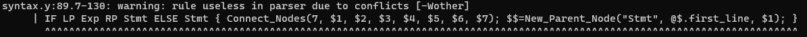
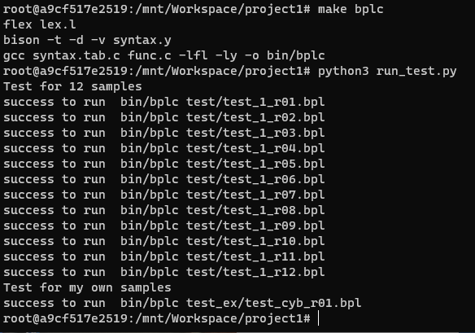
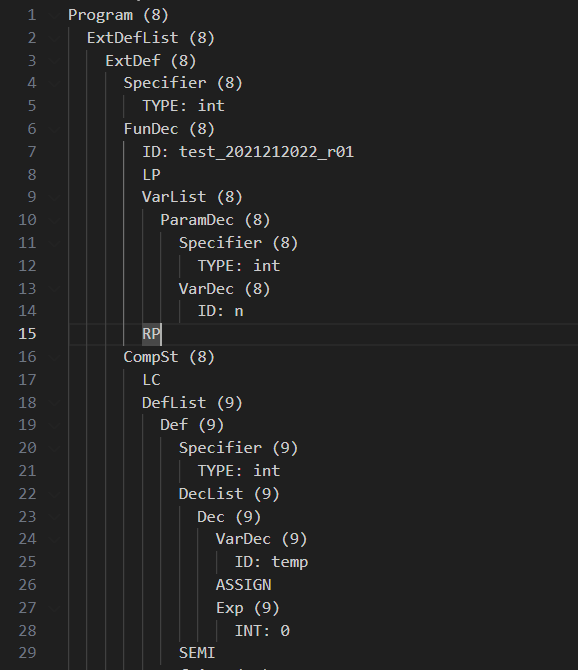
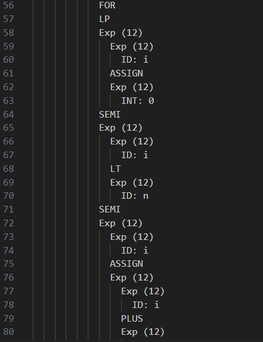

# Project1: Lexical Analysis & Syntax Analysis

## 头文件解析

### 结构体解析

​		func.h头文件中，我创建了一个新的结构体，名为Node，并定义了一系列枚举常量Node_TYPE，作为区别每个节点的特征类型，定义如下。可以看到结构体中保存了孩子节点和兄弟节点的指针与数量、节点中value与其类型以及节点的名称。由于每个节点只会有一种类型的value，所以我们把不同类型的value union在一起，节省空间。

```c
typedef enum {
    LINE,
    NAME,
    STRING,
    CHAR_TYPE,
    INT_TYPE,
    FLOAT_TYPE,
    NOTHING,
} Node_TYPE;

typedef struct Node{
    char* name;
    char* str_value;
    Node_TYPE type;

    int sib_num;
    int sub_num;
    struct Node* child;
    struct Node* sibling;
    union{
        int linenum;
        char* char_value;
        int int_value;
        float float_value;
    };
}Node;

FILE *in;
FILE *out;

Node* New_Node(char* name, char* value, Node_TYPE type);
Node* New_Parent_Node(char* name, int value, Node* child);
void Connect_Nodes(int num, ...);
void Node_print(FILE *file_pointer, Node* head_node, int space);
void freeAST(Node* head);
void Type_B_Error(char* msg);
```

### 函数功能解析

建立结构体之后，我们又定义了New_Node、New_Parent_Node、Connect_Nodes、Node_print、freeAST以及Type_B_Error函数，这几个函数在接下来的词法分析和语法分析中都会用到。

#### New_Node函数

​		这个函数用来初始化一个新的节点，这个节点里保存的一般是终结符号，非终结符要用另一个函数来初始化，接受三个参数，分别是节点的名字、节点的value和节点的类型。初始化了孩子节点为空、数量为0，兄弟节点为空、sib_num为1，需要注意的是，这里的sib_num并不是兄弟节点的数量，而是自己本身加兄弟节点的数量。接下里判断传入的type是什么，由于传入的value全部都是字符串指针，所以在判断好value类型之后需要进行类型转化再为node->value赋对应类型的值。

```c
Node* New_Node(char* name, char* value, Node_TYPE type){
    Node* node=(Node*)malloc(sizeof(Node));

    node->sub_num=0;
    node->sib_num=1;
    node->child=NULL;
    node->sibling=NULL;

    node->name=name;
    node->type=type;
    if(type==INT_TYPE){
        node->int_value=atoi(value);
    }
    else if(type==FLOAT_TYPE){
        node->float_value=atof(value);
    }
    else if(type==LINE){
        node->linenum=atoi(value);
    }
    else if(type==CHAR_TYPE){
        char* char_value = (char*)malloc(strlen(value) + 1); 
        strcpy(char_value, value); 
        node->char_value = char_value; 
    }
    else{
        char* str_value = (char*)malloc(strlen(value) + 1); 
        strcpy(str_value, value); 
        node->str_value = str_value; 
    }
    return node;
}
```

#### Connect_Nodes函数

这个函数用来把几个节点连接在一起，成为彼此的兄弟节点，接受节点的数量和所有需要进行连接的节点的指针。通过循环我们把前一个节点的兄弟节点的指针指向下一个节点，最后一个节点指向空。并设置所有节点的sib_num为num，也就是这几个节点的总数。这样我们的父节点的child指针只需要指向第一个节点即可。

```c
void Connect_Nodes(int num,...){
    va_list valist;
    va_start(valist,num);
    Node* node=va_arg(valist, Node*);
    node->sib_num=num;
    for(int i=1;i<num;++i)
    {
        Node* next=va_arg(valist, Node*);
        node->sibling=next;
        node=next;
        node->sib_num=num;
    }
    node->sibling=NULL;
    va_end(valist);
}
```


#### New_Parent_Node函数

​		这个函数用来初始化一个新的父节点，传入三个参数，分别是节点名称，节点的value以及一个指向孩子节点的指针。这个函数一般被用来初始化非终结符，因为非终结符一般是需要进行规约的，让他们作为父节点即可。由于非终结符本身没有一个明确的值，所以父节点的value用来保存的是用来规约的第一个终结符所在的行数（@$.first_line），因此父节点的type默认为LINE。设置兄弟节点指向空、sib_num为0，设置传入的指针为孩子节点指针、孩子节点数目即为孩子节点中保存的sib_num。需要注意的是在这之前要初始化孩子节点数目为0，因为如果传入的最后一个参数为NULL，则它不具有sib_num，会出错。

```c
Node* New_Parent_Node(char* name, int value, Node* child){
    Node* node=(Node*)malloc(sizeof(Node));
    node->sib_num = 1;
    node->sub_num = 0;
    node->child=child;
    if(node->child!=NULL){
        node->sub_num = child->sib_num;
    }
    node->sibling=NULL;

    node->name=name;
    node->type=LINE;
    node->linenum=value;

    return node;
}
```

#### Node_print函数

​		这个函数用来输出AST树，接受三个参数，分别为头结点指针，写入文件的指针，以及空格符的数量，在输出每个节点value之前要输入空格，也就是缩进符号，这里定义了不同type下不同的输出模式，在输出子节点时候要把缩进符号的数量加一，循环之后就可以输出一个完整的AST树。

```c
void Node_print(FILE *file_pointer, Node* head_node, int space){
    if(head_node->type!=NOTHING){
        for(int i=0;i<space;i++){
            fprintf(file_pointer, "  ");
        }
    }
    switch (head_node->type)
    {
    case LINE:
        fprintf(file_pointer, "%s (%d)\n", head_node->name,head_node->linenum);
        break;
    case NAME:
        fprintf(file_pointer, "%s\n", head_node->name);
        break;
    case STRING:
        fprintf(file_pointer, "%s: %s\n", head_node->name, head_node->str_value);
        break;
    case CHAR_TYPE:
        fprintf(file_pointer, "%s: %s\n", head_node->name, head_node->char_value);
        break;
    case INT_TYPE:
        fprintf(file_pointer, "%s: %d\n", head_node->name, head_node->int_value);
        break;
    case FLOAT_TYPE:
        fprintf(file_pointer, "%s: %f\n", head_node->name, head_node->float_value);
        break;
    default:
        break;
    }
    Node* node=head_node->child;
    while(node!=NULL){
        Node_print(file_pointer, node, space+1);
        node=node->sibling;
    }
}
```

#### freeAST、Type_B_Error函数

​		这两个函数功能比较简单，前者是释放所有节点，后者是在出现Type_B错误之后格式化写入的语句，后面会讲，这里就不加赘述了。


## 词法分析部分

### 正则表达式书写

​		我们对INT,FLOAT,CHAR,ID的正则表达式做了特别的规范，使其能够符合题目要求。其中INT的匹配包含两种，一种是十进制形式、另一种是十六进制形式，CHAR的匹配也包含两种，16进制字符形式和单字符形式。值得注意的是，我们还进行了对单行注释和多行注释的正则匹配，在匹配到注释以及换行符、空格、TAB符号时候时候直接略过。下面是正则表达式的详细内容，在匹配到CHAR_16和CHAR时都返回CHAR，匹配到UINT_10和UINT_16时候都返回INT。

```c#
%option noyywrap
%option yylineno

letters [A-Za-z]
letters_ [A-Za-z_]
digit [0-9]
digit_16 [0-9a-fA-F]
UINT_10 (0|([1-9]{digit}*))
UINT_16 0[xX](0|[1-9a-fA-F]{digit_16}*)
UFLOAT {UINT_10}\.{digit}+
CHAR '.'
CHAR_16 '\\x(0|[1-9a-fA-F]{digit_16})'
ID {letters_}({letters_}|{digit}){0,31}
annotation ("//".*|"/*"[^*]*"*"+([^*/][^*]*"*"+)*"/")
ws [ \t\r\n]+


FAKEID ([0-9]+{ID})
CHAR_error ('\\x0{2,}{digit_16}*'|'\\x([1-9a-fA-F]){digit_16}*[g-z]{digit_16}*')
UINT_16_error 0[xX]([0-9a-fA-F]*[g-zG-Z]+[0-9a-fA-F]*)+
```

### 正则匹配处理

​		之后我们进行了匹配之后的函数处理，将匹配后的词素生成为一个新的节点，value就是yytext，type根据匹配到的词素类型进行命名，并通过yylval传到语法分析中去，每一个匹配语句形式都类似于以下的语句，全部的语句就不在这里展示了

```c
"int" { yylval.Token_value = New_Node("TYPE", "int", STRING); return TYPE; }
"float" { yylval.Token_value = New_Node("TYPE", "float", STRING); return TYPE; }
"char" { yylval.Token_value = New_Node("TYPE", "char", STRING); return TYPE; }
```

### 异常处理与难点分析

​		最后我们进行了异常处理，在之前的正则表达式书写时，我们还定义了错误词法的匹配规则，解释如下：

- CHAR_error：匹配了/x后多了0的情况，以及字母不在十六进制的字符范围内的错误情况
- FAKEID：匹配了正常ID之前有一个或多个数字的错误情况
- UINT_16_error：匹配了0x之后含有有不属于十六进制字符的错误情况

​		但是，值得注意的是，在进行错误匹配之后不能什么都不返回，因为这样会让词法分析停止，不能对之后的内容继续进行分析，所以我们在匹配并且输出错误信息之后，还要再返回一个token，这里我把他命名为ILLEGAL_TOKEN，这样就可以让即使此时检测出问题，之后也能继续进行词法分析。但是，我们在做语法分析时候发现INT和CHAR的词素只有在对EXP进行规约时候才会用到，因此我们返回的ILLEGAL_TOKEN只需要加一个Exp->ILLEGAL_TOKEN的规则就可以让他匹配上。但对于ID却不能这样，在语法分析中不止Exp的规约用到ID，所以我们如果要返回的话，就不能返回ILLEGAL_TOKEN，这里我在匹配到错误ID后仍然返回了ID，这能保证语法分析过程中不出错误，同时还设置了全局变量isError为1，在之后进行MAIN函数输出语法树的时候检测到isError就不会输出语法树，而只有错误报告，这样我们就实现了在检测到TYPE A错误时候能够继续分析，同时还保证了发生错误时不输出AST树的功能，这是我在实验中遇到的一个难点。

```c
{CHAR_error} {
    isError=1;
    fprintf(out,"Error type A at Line %d: Wrong hex format for char '%s'\n",yylineno, yytext);
    return ILLEGAL_TOKEN;
}
{UINT_16_error} {
    isError=1;
    fprintf(out,"Error type A at Line %d: Wrong hex format for int '%s'\n",yylineno, yytext);
    return ILLEGAL_TOKEN;
}
{FAKEID} {
    isError=1;
    fprintf(out,"Error type A at Line %d: Wrong format for ID '%s'\n",yylineno, yytext);
    return ID;
}
. {
    isError=1;
    fprintf(out,"Error type A at Line %d: unknown lexeme '%s'\n",yylineno, yytext);
    return ILLEGAL_TOKEN;
}
```


## 语法分析部分

### 声明部分

​		我们定义了不论终结符还是非终结符的类型都是Node类型结构体，并依据文档给出的优先级进行了排列。还加入了之前返回的ILLEGAL_TOKEN，把它连同ELSE、LOWER_MINUS一同设置为不关联的结合性，并将其放在合适位置。在编译过程中，我们遇到了如下的报错，这就是因为没有把ELSE放在合适优先级下的后果，我们把ELSE放置在最高优先级即可解决这一问题



具体的声明如下

```c#
%nonassoc LOWER_ERROR

%type <Token_value> Program ExtDefList ExtDef ExtDecList Specifier
%type <Token_value> StructSpecifier VarDec FunDec VarList ParamDec
%type <Token_value> CompSt StmtList Stmt DefList Def DecList Dec Args Exp

%token <Token_value> SEMI COMMA
%token <Token_value> LC RC
%token <Token_value> TYPE STRUCT
%token <Token_value> IF WHILE RETURN FOR
%token <Token_value> INT
%token <Token_value> FLOAT
%token <Token_value> CHAR
%token <Token_value> ID

%right <Token_value> ASSIGN
%left <Token_value> OR
%left <Token_value> AND
%left <Token_value> LT LE GT GE NE EQ
%nonassoc LOWER_MINUS
%left <Token_value> PLUS MINUS
%left <Token_value> MUL DIV
%right <Token_value> NOT
%left <Token_value> LP RP LB RB DOT

%nonassoc <Token_value> ILLEGAL_TOKEN
%nonassoc <Token_value> ELSE
```

### 语法规范部分

​		以文档给出的语法规范作为框架，编写规约成功后的行为。每一次规约成功后，都去执行Connect_Nodes函数，把规约式右边的Token节点连接在一起，并使用New_Parent_Node函数，将连接起来的节点作为孩子节点连接到规约式左面的非终结符节点上。比如

```c#
ExtDef: Specifier ExtDecList SEMI { Connect_Nodes(3, $1, $2, $3); $$=New_Parent_Node("ExtDef", @$.first_line, $1); }
```

​		这句话就是在匹配到Specifier ExtDecList SEMI之后将其规约为ExtDef，并把Specifier ExtDecList SEMI三者节点通过Connect_Nodes函数连接起来，再新建夫节点ExtDef，让父节点的孩子节点指针指向连接起来的第一个节点。

​		值得注意的是，有些非终结符可以由NULL规约而来，这里我们就需要用New_Parent_Node创建父节点，并把它的孩子节点指针指向NULL，而不是不做处理，如果不做处理的话会有报错。还需要注意的就是对于ILLEGAL_TOKEN，我们的做法是设置一条规则`Exp: ILLEGAL_TOKEN {}`，让他能够匹配，但不做任何操作。

### 错误处理部分

​		首先我们定义了yyerror函数，具体如下，让他在匹配到error时候将isError置1，并输出错误类型为B，以及错误发生的行数。

```c
void yyerror(const char *s){
    isError=1;
    fprintf(out,"Error type B at Line %d: ",yylloc.first_line-1);
}
```

​		我们知道`error`实质上属于通配符，并不会因为匹配到error而停止分析过程，因此在匹配到error之后还可以定义一个在大括号中的行为，这个行为在执行完系统的yyerror函数之后就会被执行。我们为规则的适当位置加入错误处理之后，根据这个错误引发的原因我们调用Type_B_Error函数来完成具体错误的输出，比如

```c
FunDec: ID LP VarList error { Type_B_Error("Missing RP \')\'"); }
```

​		这一条就是在缺少右括号的情况下将会进行error处理，并调用Type_B_Error("Missing RP \')\'")，由于yyerror是比Type_B_Error先执行的，所以整体会写入这样一条句子（假设错误发生在第二行）：

```
Error type B at Line 2: Missing RP \')\'
```

​		错误处理所有规则就不在这里展示了，已经包含在了文件中。值得注意的是这一部分的编写很容易出现移入规约冲突，同时还容易导致二义性，在这个过程中，我选择每写一条错误处理，进行以此makefile来保证能定位到冲突发生在哪里。


## Main函数部分

​		main函数中先对输入的命令进行检测，如果正确则看执行的文件后缀是否是bpl，若不是则报错，在确认命令正确后，把原文件名字存入name，并修改后缀为out，作为我们输出文件的文件名。接下来开始进行词法和语法分析，如果出现错误，那么不输出语法树，如果没有错误则输出语法树，最后关闭文件并free掉AST树的节点内存。

```c
int main(int argc, char **argv) {
    if (argc < 2) {
        fprintf(stderr, "no input path\n");
        return 1;
    }
    else if (argc > 2) {
        fprintf(stderr, "too much input path\n");
        return 1;
    }
    else{
        in = fopen(argv[1], "r");
        if (!in) {
            perror(argv[1]);
            return 1;
        }

        char name[20];
        strcpy(name, argv[1]);
        char *p = strstr(name, ".bpl");
        if (!p) {
            fprintf(stderr, "Input file should have the '.bpl' extension.\n");
            fclose(in);
            return 1;
        }
        strcpy(p, ".out");

        out = fopen(name, "w");
        yyrestart(in);
        yyparse();

        if(isError==0){
            Node_print(out,root_Node,0);
        }
        freeAST(root_Node);
        root_Node = NULL;

        fclose(out);
        fclose(in);
    }
    return 0;
}
```


## Makefile部分

代码如下，把syntax.tab.c、func.c进行联合编译，因为syntax.y中已经Include过lex.yy.c了，这里就不把他一起放进来

```c
CC=gcc
FLEX=flex
BISON=bison


.PHONY: clean
.lex: lex.l
	$(FLEX) lex.l
.syntax: syntax.y
	$(BISON) -t -d -v syntax.y
bplc: .lex .syntax
	$(CC) syntax.tab.c func.c -lfl -ly -o bin/bplc
clean:
	@rm -f lex.yy.c syntax.tab.* *.output *.so
```


## 扩展功能演示

编译bplc之后我们写了一段python代码对其进行全部文件的测试，其中还有一个我自己写的文件，其中包含了单行注释、多行注释、for循环的处理。



代码如下

```c
//Chen Yu Bo
//Testing for whole-line comments. It's the first line
/*Testing for multi-line comments
  It's the first line
  It's the second line
  It's the third line */

int test_2021212022_r01(int n){
    int temp = 0;
    int i = 0;
    int n = 10;
    for (i =0; i < n; i = i + 1){
        temp = temp + i;
    } 
}
```

运行后的.out文件部分截图如下



可以看到输出的文件的program开始于原文件的第八行，说明我们把注释全部忽略了，第二张图展示了我们成功识别了for循环