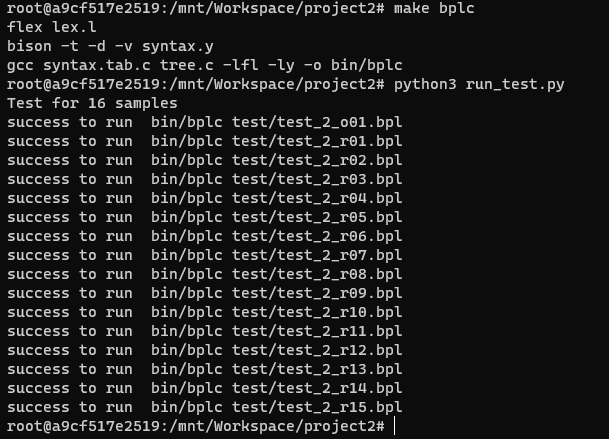

# Project2：Semantic Analysis

## 前置工作

Project2基于Project1创建的抽象语法树进行语义分析，因此有关于词法分析和语法分析的部分基本都没有修改，tree.h和tree.c也未经修改，本次报告不再对它们进行介绍。需要注意的是，因为本次语义分析实验需要输出发生错误的位置，而我们在Project1中只对非终结符在建立时引入了行号信息，在语义分析中引起错误的不仅仅是非终结符，还有终结符相关的问题，因此我们在New_Node函数接受的参数中加入了line来记录这些终结符的行号信息：

```c
New_Node(char* name, char* value, Node_TYPE type) -->
New_Node(int line, char* name, char* value, Node_TYPE type)
```

并在lex.l词法分析文件中做相应的修改：

```c
"int" { yylval.Token_value = New_Node(yylineno, "TYPE", "int", STRING); return TYPE; }
"float" { yylval.Token_value = New_Node(yylineno, "TYPE", "float", STRING); return TYPE; }
"char" { yylval.Token_value = New_Node(yylineno, "TYPE", "char", STRING); return TYPE; }
```

这样就完成了前置工作，本次实验中我们只创建了两个新文件：semantic.h和semantic.c，在接下来的介绍中我们进行详细分析


## semantic.h分析

在这个文件中我们完成了对符号表的建立，以及相关操作函数的声明

### Type表

这个表用来存储类型有关的信息，分为3种：BASIC, ARRAY, STRUCTURE，BASIC中又有：BASIC_INT_TYPE, BASIC_FLOAT_TYPE, BASIC_CHAR_TYPE三种类型来进行区分，具体建立如下：

```c
struct _Type{
    enum{BASIC, ARRAY, STRUCTURE} kind;
    union{
        int basic;
        struct{
            Type* elem;
            int size;
        }array;
        FieldList* structure;
    }u;
};
enum{
    BASIC_INT_TYPE, BASIC_FLOAT_TYPE, BASIC_CHAR_TYPE
};
struct _FieldList{
    char* name;
    Type* type;
    FieldList *next;
};
```

结构体和数组类型用两个结构体保存，array结构体中保存数组的大小和数组中内容的类型，FieldList中保存结构体中各个元素的名字类型，并把他们连成链表进行存储。

### Type_node表

这个表用来存储多个在一起的类型，适用于在分析函数时候对其参数列表进行存储，其具体实现如下：

```c
struct _Type_node{
    Type *type;
    Type_node *next;
    char *name;
};
```

### Func_hash_node表

这个表建立了一个存储函数相关信息的哈希表，具体实现如下：

```c
struct _Func_hash_node{
    char *name;
    int lineno;
    int whether_dec;
    int whether_def;
    Func_hash_node *next;
    Func_hash_node *last;
    Type *return_type;
    Type_node* para_type_list;
};
```

`name`：记录函数名

`lineno`：记录函数出现的行号

`whether_dec`：记录它是否已经被声明

`whether_def`：记录它是否被定义

`next`：指向哈希表中下一个位置

`last`：记录哈希表中上一个位置

`return_type`：记录返回类型

`para_type_list`：记录所需参数的类型表


### Var_hash_node表

这个表建立了一个存储变量相关信息的哈希表，具体实现如下：

```c
struct _Var_hash_node
{
    char *name;
    int lineno;
    int depth;
    Type *type;
    Var_hash_node *next;
    Var_hash_node *last;
};
```

`name`：记录变量名

`lineno`：记录变量出现的行号

`depth`：记录变量所在的深度，用来实现区分全局变量和局部变量作用域

`type`：记录变量的类型

`next`：指向哈希表中下一个位置

`last`：记录哈希表中上一个位置


### 其他

在semantic.h中初始化了上述的两张哈希表，其中HASH_TABLE_SIZE为0x3fff，这个大小对于本次实验已经足够，具体如下

```c
Var_hash_node *var_hash_table[HASH_TABLE_SIZE + 1];
Func_hash_node *func_hash_table[HASH_TABLE_SIZE + 1];
```

还进行了对于这几个表的操作的相关声明，分别实现了获取对应变量和函数节点的功能：

```c
Var_hash_node* get_var_hash_node(char *key);
Func_hash_node* get_func_hash_node(char *key);
```

最后声明了进行语义分析的总函数，接受写入的文件指针以及语法树的根节点指针，用来在main函数中进行语义分析：

```c
void semantic_func(FILE *file_pointer, Node* root);
```


## semantic.c分析

### 操作哈希表

这里我们使用了自己构造的哈希函数来实现对name的哈希：

```c
unsigned int hash_func(char *name){
    unsigned int val = 0;
    for(; *name; ++name){
        val = (val << 2) + *name;
        unsigned int i = val & ~HASH_TABLE_SIZE;
        if(i)
            val = (val ^ (i >> 12)) & HASH_TABLE_SIZE;
    }
    //printf("%d\n", val);
    return val;
}
```

值得注意的是，这个函数并不最优，很可能会出现冲突的情况，也就是不同的name可能会得到相同的哈希值，遇到这样的问题，我们选择的解决冲突方式是顺延。也就是在插入哈希表的时候如果发现这个位置已经有节点，同时name并不相同，我们向后寻找一个NULL的位置插入我们的新节点，插入节点的代码如下：

```c
void insert_to_val_table(char *name, int line, Type *type){
    Var_hash_node *existed_node = get_var_hash_node(name);
    if(existed_node != NULL){
        if(type->kind == STRUCTURE){
            semantic_error(15, line, name);
            return;
        }
        else if(existed_node->type->kind == STRUCTURE){
            semantic_error(3, line, name);
        }
        else {
            //in the same scope
            if(existed_node->depth == cur_depth){
                semantic_error(3, line, name);
                return;
            }
        }
    }
    unsigned int i = hash_func(name);
    Var_hash_node *node = malloc(sizeof(Var_hash_node));
    node->name = malloc(strlen(name) + 1);
    strcpy(node->name, name);
    node->next = node->last = NULL;
    node->lineno = line;
    node->type = type;
    node->depth = cur_depth;
    node->op = NULL;
    if(var_hash_table[i] == NULL){
        var_hash_table[i] = node;
    }
    else{
        Var_hash_node *tmp = var_hash_table[i];
        while(tmp->next != NULL){
            tmp = tmp->next;
        }
        node->last = tmp;
        tmp->next = node;
    }
}
void insert_to_func_table(char *name, int line, Type *return_type, Type_node* para_type_list, int defined){
    unsigned int i = hash_func(name);
    Func_hash_node *node = malloc(sizeof(Func_hash_node));
    node->name = malloc(strlen(name) + 1);
    strcpy(node->name, name);
    node->next = node->last = NULL;
    node->whether_dec = 0;
    node->whether_def = defined;
    node->lineno = line;
    node->return_type = return_type;
    node->para_type_list = para_type_list;
    if(func_hash_table[i] == NULL){
        func_hash_table[i] = node;
    }
    else{
        Func_hash_node *tmp = func_hash_table[i];
        while(tmp->next != NULL){
            tmp = tmp->next;
        }
        node->last = tmp;
        tmp->next = node;
    }
}
```

插入节点时实现了对这个节点中各个信息的初始化。需要注意的是，在插入函数节点时候的define值是为了应对先声明后定义的情况，这种情况下会出现两次函数名，如果不加入define则会出现误报。

接着我们定义了获取哈希表节点的函数，由于之前介绍过的冲突原因，所以在对比哈希值后还要对比参数key和节点的name是否相同才能正确返回。

```c
Var_hash_node* get_var_hash_node(char *key){
    int id = hash_func(key);
    Var_hash_node *tmp = var_hash_table[id];
    Var_hash_node *ans = NULL;
    while(tmp != NULL){
        if(strcmp(key, tmp->name) == 0){
            ans = tmp;
            return ans;
        }
        tmp = tmp->next;
    }
    return ans;
}

Func_hash_node* get_func_hash_node(char *key){
    int id = hash_func(key);
    Func_hash_node *tmp = func_hash_table[id];
    while(tmp != NULL){
        if(strcmp(key, tmp->name) == 0){
            return tmp;
        }
        else{
            tmp = tmp->next;
        }
    }
    return NULL;
}
```

### 功能函数

我们在semantic.c中定义了一些功能函数来便利我们的工作

```c
Node* Node_chlid(Node* node, int num);
void node_type_check(Node *node, char *correct_name);
int type_equal(Type *a, Type *b);
int paralist_equal(Type_node *para1, Type_node *para2);
int func_equal(Func_hash_node *func1, Func_hash_node *func2);
int equal_args_type(Type_node *para_list, Node *args);

Type *get_exp_type(Node *node);
Type* get_field_type(FieldList *field, char *id);
Type* get_id_type(Node *Vardec, Type *basic_type);
Node* get_id_node(Node *Vardec);
```

`Node_chlid`：由于我们在之前定义语法树时候父节点和孩子们是通过一个孩子节点来连接的，也即是要访问第二个孩子就要写node->chlid->sibling，这样是不够方便的，所以这个函数就是让我们更快的访问第num个孩子

`node_type_check`：用来判断节点的类型是不是我们需要的类型

`type_equal`：用来判断两个Type类型的节点是否相等，其中对于STRUCTURE类型的节点我们实现的是结构相等，也就是name可以不相等，只要具有相同的结构我们就可以视为相等

`paralist_equal`：用来的判断两个Type_node类型的参数列表链表是否相同

`func_equal`：用来判断两个Func_hash_node类型的节点是否相同，分别从名字、返回类型和参数列表来检测

`equal_args_type`：判断Type_node类型的参数列表和Args节点中几个参数是否相等

之后的几个函数分别实现了对对应名称节点的获取，根据返回类型的不同有不同的作用，为接下来的语义分析提供对应的信息，比如get_exp_type就可以在处理赋值语句时候获取右值类型来对左值类型进行判断

### 处理语义

```c
Type* handle_VarDec(Node *node, Type *basic_type);
Type* handle_StructSpecifier(Node *node);
Type* handle_Specifier(Node *node);
Type_node* handle_ParamDec(Node *node);
Type_node* handle_VarList(Node *node);
void handle_FunDec(Node *node, Type *return_type, int defined);
void handle_ExtDef(Node *node);
void handle_Def(Node *node);
void handle_Stmt(Node *node, Type *correct_type);
void handle_CompSt(Node *node, Type *correct_type, int func_flag);
```

定义了处理不同非终结符节点的函数，具体实现在代码中已经给出，这里就不多赘述。

值得注意的是，面对一个问题报两种错误的情况，我们做了一定的取舍，比如在第7个示例中，它给出了类型7和类型5两个错误，但是类型5错误是由类型7造成的，所以类型5本质上不是这个示例的根本错误。如果我们需要修改代码来修正错误，也只需要修复类型7即可，因此我们只打印类型7的错误，而不是打印所有错误。再比如面对示例9中的错误，调用函数时既没有导入正确的参数数量，也没有导入争取的参数类型，我们选择报错的是数量错误，只有在数量正确的时候我们才会去对比参数类型是否正确。

### 格式化输出

我们定义了格式化输出函数semantic_error，在分析过程中出现语义错误时候只需调用此函数即可，更加方便

```c
void semantic_error(int error_type, int lineno, char *name){
    char msg[100] = "\0";
    if(error_type == 1)
        sprintf(msg, "undefined variable: %s", name);
    else if(error_type == 2)
        sprintf(msg, "undefined function: %s", name);
    else if(error_type == 3)
        sprintf(msg, "redefine variable: %s", name);
    else if(error_type == 4)
        sprintf(msg, "redefine function: %s", name);
    else if(error_type == 5)
        sprintf(msg, "unmatching type on both sides of assignment");
    else if(error_type == 6)
        sprintf(msg, "left side in assignment is rvalue");
    else if(error_type == 7)
        sprintf(msg, "binary operation on non-number variables");
    else if(error_type == 8)
        sprintf(msg, "incompatiable return type");
    else if(error_type ==9)
        sprintf(msg, "%s", name);
    else if(error_type == 10)
        sprintf(msg, "indexing on non-array variable");
    else if(error_type == 11)
        sprintf(msg, "invoking non-function variable: %s", name);
    else if(error_type == 12)
        sprintf(msg, "indexing by non-integer");
    else if(error_type == 13)
        sprintf(msg, "accessing with non-struct variable");
    else if(error_type == 14)
        sprintf(msg, "no such member: %s", name);
    else if(error_type == 15)
        sprintf(msg, "redefine struct: %s", name);
    fprintf(file, "Error type %d at Line %d: %s\n", error_type, lineno, msg);
}
```

### 遍历函数

我们通过如下的四个函数实现对语法树的遍历和语义分析。首先初始化两张哈希表，在遍历所有节点之后就完成了对语法树的语义分析，具体代码在文件中有详细展示，最后我们的main函数只需要调用semantic_func即可进行分析，同时把输出改为了testname_2021212022.out的模式，代表我的学号

```c
void table_init(){
    for(int i = 0; i <= HASH_TABLE_SIZE; i++){
        var_hash_table[i] = NULL;
        func_hash_table[i] = NULL;
    }
}
void add_var(Node *node){
    if(strcmp(node->name, "ExtDef") == 0){
        handle_ExtDef(node);
    }
    else if(strcmp(node->name, "DefList") == 0 && node->visited == 0){
        handle_DefList(node);
    }
    else if(strcmp(node->name, "Exp") == 0){
        get_exp_type(node);
    }
}
static void tree_search(Node *node){
    if(node == NULL || node->visited == 1) return;
    add_var(node);
    for(int i = 0; i < node->sub_num; i++){
        Node* tmp=Node_chlid(node, i);
        if( tmp!= NULL){
            tree_search(tmp);
        }
    }
}
void semantic_func(FILE *file_pointer, Node* root){
    file=file_pointer;
    table_init();
    tree_search(root);
}
```


## main函数与Makefile

main函数和project1只有一个区别，就是加入了semantic_func(out, root_Node)，实现了语义分析

```c
int main(int argc, char **argv) {
    if (argc < 2) {
        fprintf(stderr, "no input path\n");
        return 1;
    }
    else if (argc > 2) {
        fprintf(stderr, "too much input path\n");
        return 1;
    }
    else{
        in = fopen(argv[1], "r");
        if (!in) {
            perror(argv[1]);
            return 1;
        }

        char name[20];
        strcpy(name, argv[1]);
        char *p = strstr(name, ".bpl");
        if (!p) {
            fprintf(stderr, "Input file should have the '.bpl' extension.\n");
            fclose(in);
            return 1;
        }
        strcpy(p, "_2021212022.out");

        out = fopen(name, "w");
        yyrestart(in);
        yyparse();

        if(isError==0){
            semantic_func(out, root_Node);
        }
        freeAST(root_Node);
        root_Node = NULL;

        fclose(out);
        fclose(in);
    }
    return 0;
}
```

makefile文件没有任何区别，因为main函数是定义在syntax.y文件中的，而syntax.y现在include了semantic.h，因此也不需要加入semantic.h进行联合编译


## 测试脚本

我们还写了run_test.py脚本来实现对16个示例的测试，其中第一个test_2_o01.bpl测试没有输出，因为语义分析中我实现了对局部变量和全局变量的区分以及其他能够识别更多错误的功能，测试结果如下：

